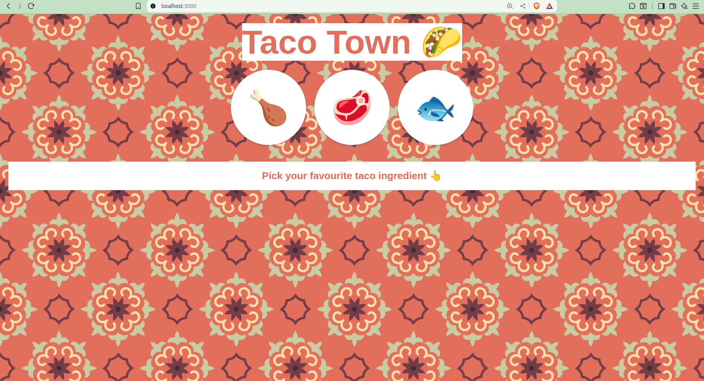

# 🌮 Taco Recipes

A simple Node.js + Express web application to display taco recipes using **JSON parsing**, **EJS templating**, and **user-selected options**.

---
## 🖼️ Website Preview

---

## 📌 Features

- Users can choose between **Chicken**, **Beef**, or **Fish** tacos.
- Based on the selection, the app displays:
  - The **taco name**
  - Its **ingredients**: protein, salsa, and toppings
- JSON parsing is used to dynamically fetch the recipe from hardcoded JSON data.

---

## 🚀 Tech Stack

| Tech         | Description                       |
|--------------|-----------------------------------|
| Node.js      | JavaScript runtime                |
| Express.js   | Web framework                     |
| EJS          | Templating engine                 |
| body-parser  | Parses incoming request bodies    |
| HTML/CSS     | For frontend styling (static files in `public/`) |

